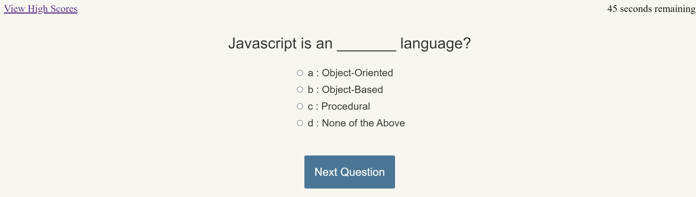

# webAPI-module4

## Solution for Module 4 Challenge

This site has been created as an interactive quiz to test the knowledge of the participant and give a score based on the performance.  A penalty is assesed for incorrect answers, subtracting from the time based score.  After completion, the participant can enter their initials to log their score, as well as view previous scores and their rankings.  

[Link to Page](https://fryylord.github.io/webAPI-module4/)

- [Installation](#installation)
- [Usage](#usage)
- [Credits](#credits)
- [License](#license)

## Installation

All you need is the index.html file, allong with the directory assets.  These should be in the parent repository directory, with assets being a child directly within the parent.

## Usage

To test the users knowledge in javascript, record and retrieve scores based on performance.    

## Credits

While much of this was assembled on my own, various pieces of source code from https://ku.bootcampcontent.com/ku-coding-boot-camp/KU-VIRT-FSF-PT-09-2022-U-LOLC/ have been used.  

## License
 
MIT License

Copyright (c) 2022 fryylord

Permission is hereby granted, free of charge, to any person obtaining a copy
of this software and associated documentation files (the "Software"), to deal
in the Software without restriction, including without limitation the rights
to use, copy, modify, merge, publish, distribute, sublicense, and/or sell
copies of the Software, and to permit persons to whom the Software is
furnished to do so, subject to the following conditions:

The above copyright notice and this permission notice shall be included in all
copies or substantial portions of the Software.

THE SOFTWARE IS PROVIDED "AS IS", WITHOUT WARRANTY OF ANY KIND, EXPRESS OR
IMPLIED, INCLUDING BUT NOT LIMITED TO THE WARRANTIES OF MERCHANTABILITY,
FITNESS FOR A PARTICULAR PURPOSE AND NONINFRINGEMENT. IN NO EVENT SHALL THE
AUTHORS OR COPYRIGHT HOLDERS BE LIABLE FOR ANY CLAIM, DAMAGES OR OTHER
LIABILITY, WHETHER IN AN ACTION OF CONTRACT, TORT OR OTHERWISE, ARISING FROM,
OUT OF OR IN CONNECTION WITH THE SOFTWARE OR THE USE OR OTHER DEALINGS IN THE
SOFTWARE.

## Features

Simple user interface
Adaptive for use on varying devices
Time based scoring system
Tracking and ranking of achieved scores over time

## Tests

None